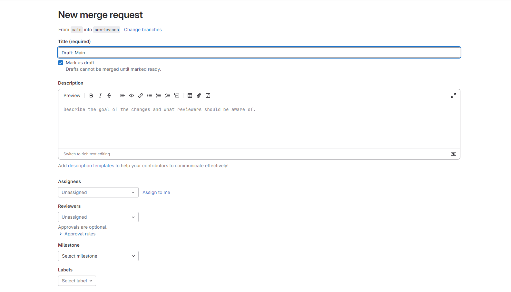

# test-research
Research repository for meeting with TA on Friday, September 2024

# Branching

To create a new branch on GitHub, first navigate to your selected repository, and select the New Branch button as is indicated below. 

Then, in the following dialog, name your new branch and select Create New Branch

In GitLab, the dialogs are similar, but the location is different

The Branch creation dialog can be accessed through the Branches directory of the project

One way you can access this directory is through the plus button on the branch page

Another is through the information panel on the right

You can create a new branch by clicking the New Branch button

# Merge Requests 
Pull requests, called pull requests on GitHub and merge requests on GitLab, are requests to merge the content of two Git branches

To create a pull request on GitLab, navigate to the Merge Requests directory and select Create Merge Request 

It will then prompt you for the source branch and destination branch, along with information regarding the request

Fill in all of the information, and proceed to view your merge request! 

On GitHub, the process is very similar

Navigate to the Pull requests tab, and select to create a new request

Here, you select the two branches to merge, and review a comparison between the two

Select the Merge button (or its equivalent on GitLab) to proceed 

GitLab equivalent shown below

After merging, the contents of the two directories will be merged together, as is seen below

